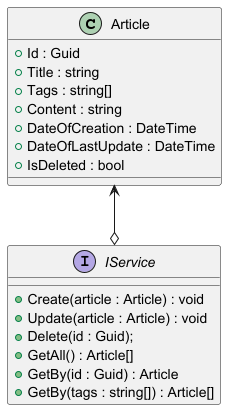

[](https://www.codefactor.io/repository/github/anst-foto/knowledgebase)

# База знаний

## Модель данных

```csharp
public class Article
{
    public Guid Id { get; init; }
    public required string Title { get; set; }
    public List<string> Tags { get; set; } = [];
    public required string Content { get; set; }
    public DateTime DateOfCreation { get; init; }
    public DateTime DateOfLastUpdate { get; set; }
    public bool IsDeleted { get; set; } = false;
}
```

```csharp
public interface IService
{
    public void Create(Article article);
    public void Update(Article article);
    public void Delete(Guid id);
    public IEnumerable<Article> GetAll();
    public Article? GetBy(Guid id);
    public IEnumerable<Article>? GetBy(IEnumerable<string> tags);
}
```



## WebAPI

```csharp
const string BASE_URL = "/api/v0";

app.MapGet($"{BASE_URL}/articles", () => service.GetAll());
app.MapGet($"{BASE_URL}/articles/{{id:guid}}", (Guid id) => service.GetBy(id));
app.MapGet($"{BASE_URL}/articles/tags", (HttpContext context) =>
{
    var tags = context.Request.Query["tags"].ToList();
    return service.GetBy(tags);
});
app.MapPost($"{BASE_URL}/articles", (Article article) => service.Create(article));
app.MapPut($"{BASE_URL}/articles", (Article article) => service.Update(article));
app.MapDelete($"{BASE_URL}/articles/{{id:guid}}", (Guid id) => service.Delete(id));

```

## Running the Project with Docker

This project provides Docker support for both the Web API and Desktop (Avalonia) applications. The setup uses .NET 9.0 and is orchestrated via Docker Compose.

### Requirements
- Docker and Docker Compose installed
- .NET version: **9.0** (as specified in the Dockerfiles)
- No required environment variables by default (see below for optional configuration)

### Services and Ports
- **csharp-knowledgebase-webapi**
    - Exposes: **8080** (mapped to host 8080)
    - Environment: `ASPNETCORE_URLS` is set to `http://+:8080` by default
- **csharp-knowledgebase-desktop**
    - No ports exposed (desktop GUI app, typically not run in a container, but included for completeness)

### Build and Run Instructions
1. Ensure you are in the project root directory (where `compose.yaml` is located).
2. Build and start the services:
   ```sh
   docker compose -f compose.yaml up --build
   ```
   This will build both the Web API and Desktop containers and start them.

### Configuration Notes
- **Environment Variables:**
    - No required environment variables are set by default. If you need to customize settings (e.g., connection strings), uncomment and edit the `env_file` or `environment` sections in `compose.yaml` for each service.
- **Networks:**
    - Both services are connected to the custom Docker network `kbnet`.
- **Dependencies:**
    - The Desktop app depends on the Web API service (`depends_on` is set in Compose).
- **Database:**
    - No database service is defined in the provided Compose file. If your Web API requires a database, you must add it to `compose.yaml` and configure the connection string accordingly.

### Special Notes
- The Desktop (Avalonia) app is included in the Compose setup for completeness, but running GUI applications in containers is not typical. You may need additional configuration (e.g., X11 forwarding) to interact with the desktop UI from a container.
- All builds use multi-stage Dockerfiles for optimized image size and security (non-root user).

---

_Keep this section up to date if you change Dockerfiles or Compose configuration._
